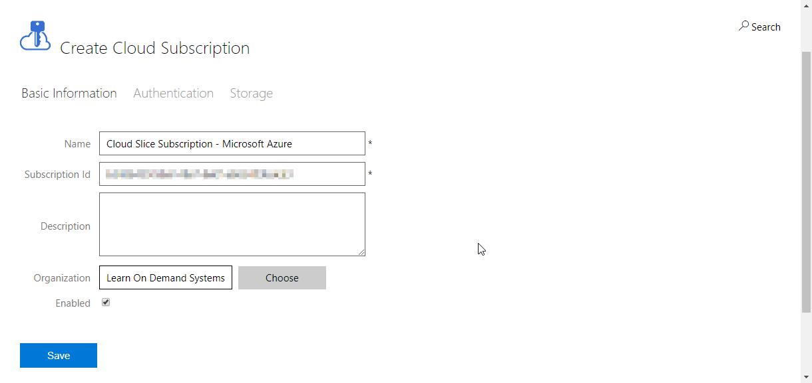
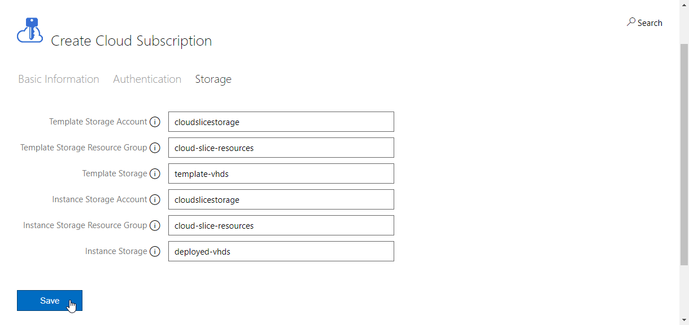

# Cloud Slice Guide

This guide will walk you through how to create a lab that provisions a dynamically created cloud subscription, which may also contain one or more cloud resources (virtual machines, networks, databases, websites, etc.), to each student using that lab. Each student will have access to the cloud subscription and the resources it contains for the duration of the lab. This subscription, combined with the resources contained within it, are collectively referred to as a Cloud Slice.

The Cloud Slice feature allows you to create labs in the cloud that are pre-configured with compute, networking, and storage resources, and/or that allow students to create their own compute, networking, and storage resources as part of the tasks they must complete within that lab. There are several tasks you must perform before you can move forward with Cloud Slice support in your labs. Any optional tasks are appropriately marked with "(Optional)". As you work through these tasks, you can use the list below to navigate to the task you are currently working on and then return to the list to continue with another task.

1. [Enable Cloud Slice support on the cloud platform of your choice](#enable-cloud-slice-support-in-your-cloud-platform).
2. [Create a Cloud Subscription in OneLearn Lab on Demand](#create-a-cloud-subscription-in-onelearn-lab-on-demand).
3. [Create a Cloud Subscription Pool in OneLearn Lab on Demand](#create-a-cloud-subscription-pool-in-onelearn-lab-on-demand).
4. [(Optional) Upload any virtual hard disks that you want accessible as templates or instances into the appropriate storage container in your cloud platform](#upload-template-and-instance-vhds-into-your-cloud-platform).
5. [(Optional) Create a Cloud Resource Template for each template that you want to use during the deployment of your lab(s)](#create-cloud-resource-templates-in-onelearn-lab-on-demand).
6. [Add Cloud Slice support to your lab profile(s\)](#add-cloud-slice-support-to-your-lab-profiles).
7. [(Optional) Add a Cloud Exam to your lab profile(s) if you want the labs scored](#add-a-cloud-exam-to-your-lab-profiles).

## Enable Cloud Slice Support in your cloud platform

To expose the Cloud Slice capability to your lab(s), you must first provide access to the OneLearn Lab on Demand platform for cloud platform that your students will be using from within your lab(s). How you set that up depends on the cloud platform that you use.

Please choose one of the following cloud platforms to learn how you can provide the required access to that platform. If the platform listed is not a hyperlink, that platform is not yet supported.

1. [Microsoft Azure][azure-setup]
2. Amazon Web Services (coming soon)
3. Google Cloud Platform (coming soon)

[azure-setup]: microsoft-azure/cloud-slice-setup.md "How to enable Cloud Slice support in Microsoft Azure"

[Back to top][back-to-top]

## Create a Cloud Subscription in OneLearn Lab on Demand

Once you have enabled Cloud Slice support in the cloud platform of your choice (see previous section), you need to add a Cloud Subscription to OneLearn Lab on Demand. This Cloud Subscription will be used by labs from which you want to provision Cloud Slices. To add a managed Cloud Subscription to OneLearn Lab on Demand, you must perform the following steps:

1. Navigate to the <a href="https://labondemand.com" target="_blank">OneLearn Lab on Demand portal</a> and sign in.

2. Open the **Cloud Subscriptions** section on the Cloud Services tile.

   

3. Click on **Create Cloud Subscription** to add a new managed cloud subscription to OneLearn Lab on Demand.

   

4. Populate the following required fields in the **Create Cloud Subscription** form:

   | Tab                   | Field Name          | Description                              |
   | --------------------- | ------------------- | ---------------------------------------- |
   | **Basic Information** | **Name**            | The name you want to use to identify your managed cloud subscription. |
   |                       | **Subscription Id** | The identifier that uniquely identifies the cloud subscription you are managing on the cloud platform where you have enabled Cloud Slice support. |
   | **Authentication**    | **Tenant Name**     | The name of the tenant used for deployment of Cloud Slices in your cloud service. |
   |                       | **Client ID**       | The identifier that uniquely identifies the client used to manage your cloud service subscription. |
   |                       | **Client Secret**   | The secret used to authenticate your client id in your cloud service subscription. |

   You may also provide values for the following optional fields:

   | Tab                   | Field Name                          | Description                              |
   | --------------------- | ----------------------------------- | ---------------------------------------- |
   | **Basic Information** | **Description**                     | Text used to describe the managed Cloud Subscription that you are setting up. |
   |                       | **Organization**                    | The organization in OneLearn Lab on Demand where the managed Cloud Subscription will be used. |
   |                       | **Enabled**                         | Indicates whether or not the managed Cloud Subscription is enabled. |
   | **Storage**           | **Template Storage Resource Group** | The name of a Cloud Resource Group in the managed Cloud Subscription that contains template VHDs that you would like to copy into a lab during its deployment. |
   |                       | **Template Storage Account**        | The name of a storage account inside of the Template Storage Resource Group where the template VHDs may be found. |
   |                       | **Template Storage**                | The name of a container in the Template Storage Account where the template VHDs may be found. |
   |                       | **Instance Storage Resource Group** | The name of a Cloud Resource Group in the Cloud Slice where template VHDs will be copied when a Cloud Slice lab configured to use those template VHDs is deployed. |
   |                       | **Instance Storage Account**        | The name of a storage account inside of the Instance Storage Resource Group where template VHDs will be copied when a Cloud Slice lab configured to use those template VHDs is deployed. |
   |                       | **Instance Storage**                | The name of a container in the Instance Storage Account where template VHDs will be copied when a Cloud Slice lab configured to use those template VHDs is deployed. |

   Below are some screenshots showing what that might look like.

   

   

   

   ​

5. Once you have provided the information you want to use with your managed Cloud Subscription, click **Save** to save it in OneLearn Lab on Demand.

[Back to top][back-to-top]

## Create a Cloud Subscription Pool in OneLearn Lab on Demand

[Back to top][back-to-top]

## Upload template and instance VHDs into your cloud platform

[Back to top][back-to-top]

## Create Cloud Resource Templates in OneLearn Lab on Demand

[Back to top][back-to-top]

## Add Cloud Slice Support to your lab profile(s)

[Back to top][back-to-top]

## Add a Cloud Exam to your lab profile(s)

[Back to top][back-to-top]

### LOD Cloud Subscription

Set up a new Cloud Subscription with the values defined in the following sections.

#### Basic Information

The Subscription Id field must be set to the ID of the Azure subscription that contains your Registered Application.

The Template Storage field must identify the name that will be used for the storage container created within the Storage Group for templates used in the subscription.

The Instance Storage field must identify the name that will be used for the storage container created within the Storage Group for virtual machines used in the subscription.

##### Other fields

Source: Where to copy VMs from (you set up VMs in a subscription for use in labs)

Destination: Where to copy VMs to when provisioning them to students in dynamically created subscriptions when launching labs

#### Authentication

The Tenant Name field must contain the name of your onmicrosoft.com account.

The Client ID field must be set to the Application ID for your Registered Application.

The Client Secret field must be set to the key you created for your Registered Application.

## Lab Profile

Have to include information here to ensure that Content Owner and Email field are filled in and include errata on who/how to contact if subscription resources run out.

## Attributes sent to Cloud Slice PBT scoring scripts

| Parameter Name            | Sample Value                          |
| ------------------------- | ------------------------------------- |
| $CloudSliceId             | 1-294781                              |
| $TemplateName             | Complex network with multiple subnets |
| $TemplateId               | 15                                    |
| $LabProfileId             | 18122                                 |
| $LabInstanceId            | 294781                                |
| $SubscriptionName         | My Subscription                       |
| $SubscriptionId           | f162ec58-a25b-4996-9e47-277951ae52d1  |
| $TemplateStorageContainer | template                              |
| $InstanceStorageContainer | instance                              |
| $SourceStorageAccountName | imagestorage                          |
| $DestStorageAccountName   | imagestorage                          |
| $PoolId                   | -1                                    |
| $StartTime                | 2017-08-10T18:32:03.26Z               |
| $ExpirationTime           | 2017-08-11T04:38:01.79Z               |
| $UserFirstName            | Jeff                                  |
| $UserLastName             | Smith                                 |
| $UserId                   | 12873                                 |
| $Username                 | jsmith                                |
| $UserEmail                | jsmith@example.com                    |

[back-to-top]: #cloud-slice-guide "Return to the top of the document"

